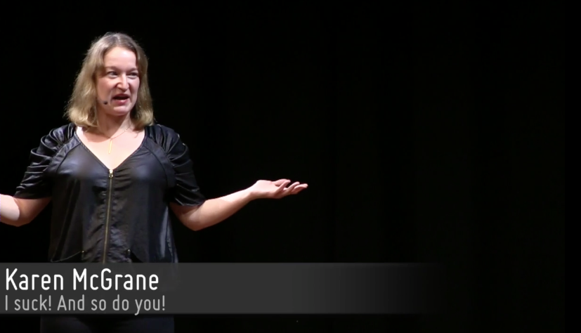
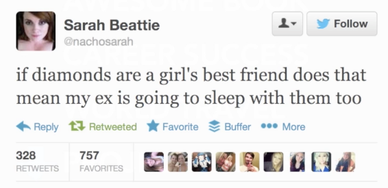

I suck! And so do you! | video of presentation by Karen McGrane at Dare Conference, 24-25 Sept 2013, London

<http://2013.dareconf.com/videos/mcgrane>

I’m better than you: I have more twitter followers than you do.

We have the need to put ourselves above other people.

We are desperately seeking validation, even from people we do not know or do not respect.

> You are worthy only if you are above average.

You can’t constantly judge yourself, you can’t live with the insecurity.

Instead of judging yourself, you start judging other people.

Instead of seeking validation from yourself, you start seeking validation from other people.

=== no win situation.

!! Be kinder to yourself. !!

breakdown = spiritual awakening

heartbreak & betrayal- secret to weight loss

Acknowledge that past happened.

Decide if crisis experience would make your life worse, or better!

When you open your vulnerabilities, others will more easily share with you.

Everybody’s got something, and we are trying our best to hide it.

Life is not just about TODOs and NOT TODOs.

Internet is always telling you how to live your live.

"You are doing it wrong” meme.

"Fuck it” point – put expectation aside. This can just be OK.

Aim for OK-ness.

Be kind to yourself.

We are defensive, fearful, we don’t trust ourselves – there is tense and we are putting it to other people.

Defensiveness prevents people from being able to have compassion they need.

Don’t be fake to yourself.

You are not alone.

We are all meant to shine, like children do.
