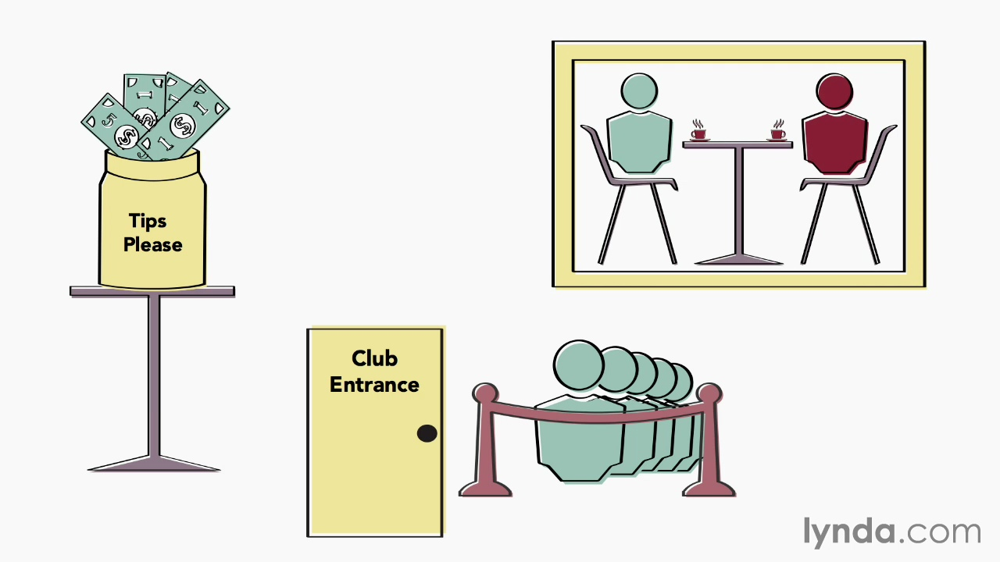
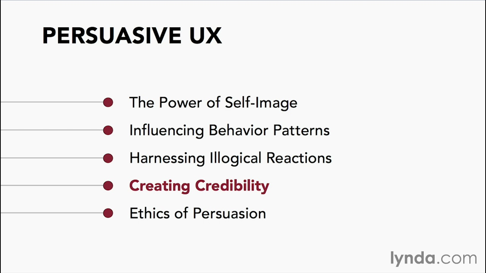

<http://www.lynda.com/Web-User-Experience-tutorials/Persuasive-UX-Creating-Credibility/162705-2.html>

Social proof

============

Impression what is the correct thing to do.

We tend to follow, even complete strangers.

If other people are doing it, it must be right.

Conformance – stand at a street, look at the sky – other will follow.

Familiarity breeds assurance.

Show popularity, number left in stock, number of buys.

Testimonials – from qualified users.

Reviews on third-party sites.

Use social media to spread good word, but solve issues in private.

Reciprocity

===========

You will be more happy to do something for me, if I have done something for you.

Give a gift first, ask for something later.

Ben Franklin effect – ask customer to do small favour, thank people immediately but do not return favour just know. Creates a feeling of liking.

Authority

=========

Level of compliance to authoritative figure.

-

-

I was just following orders.

Working as part of the group.

Authority to give people permission to do something.

Smart defaults

==============

Priming – reason for brand advertising.

Making options to look familiar.

Recommended, Preferred, …

Other similar topics

====================

[http://darkpatterns.org](http://darkpatterns.org/) – deceive people

