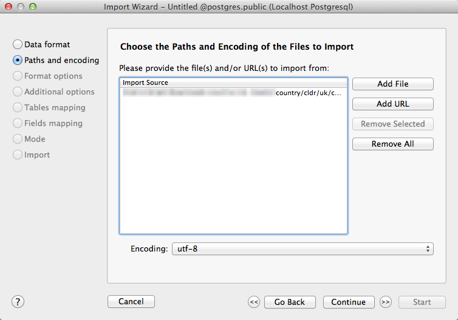
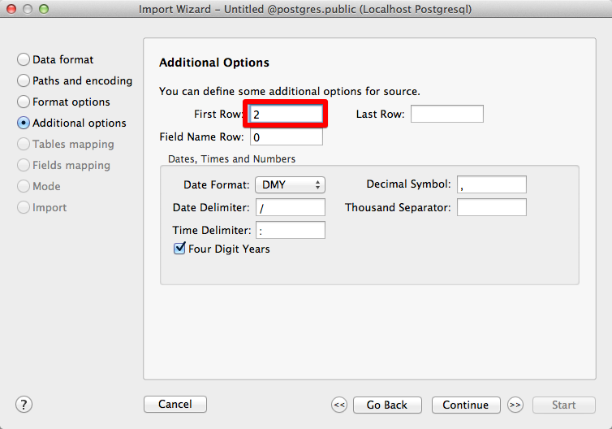
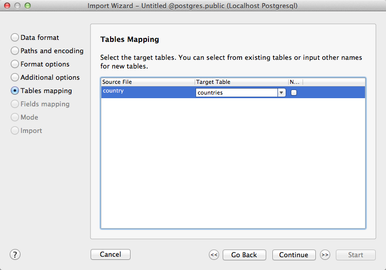
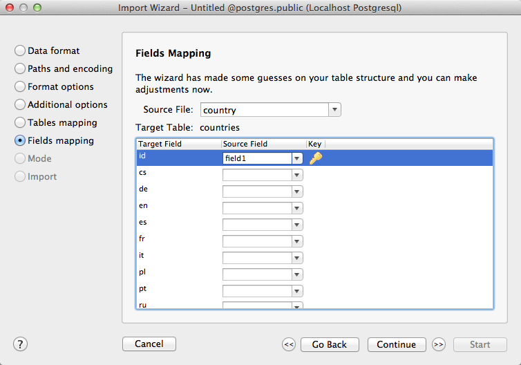
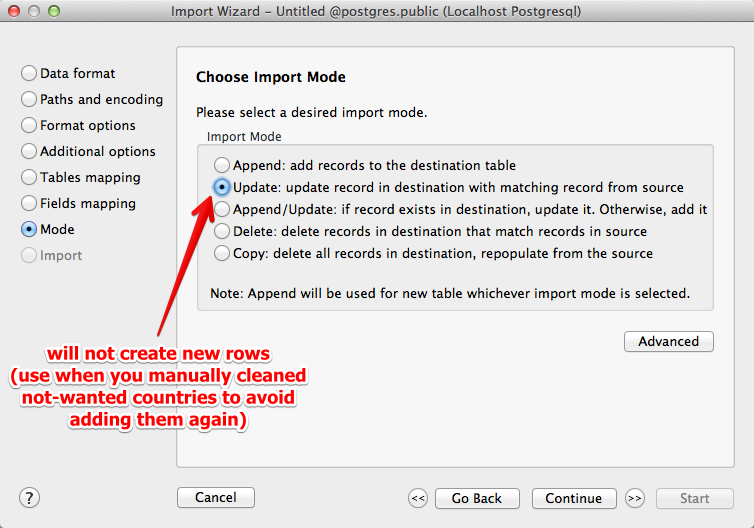
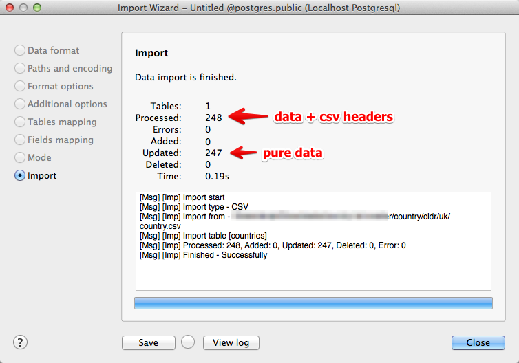
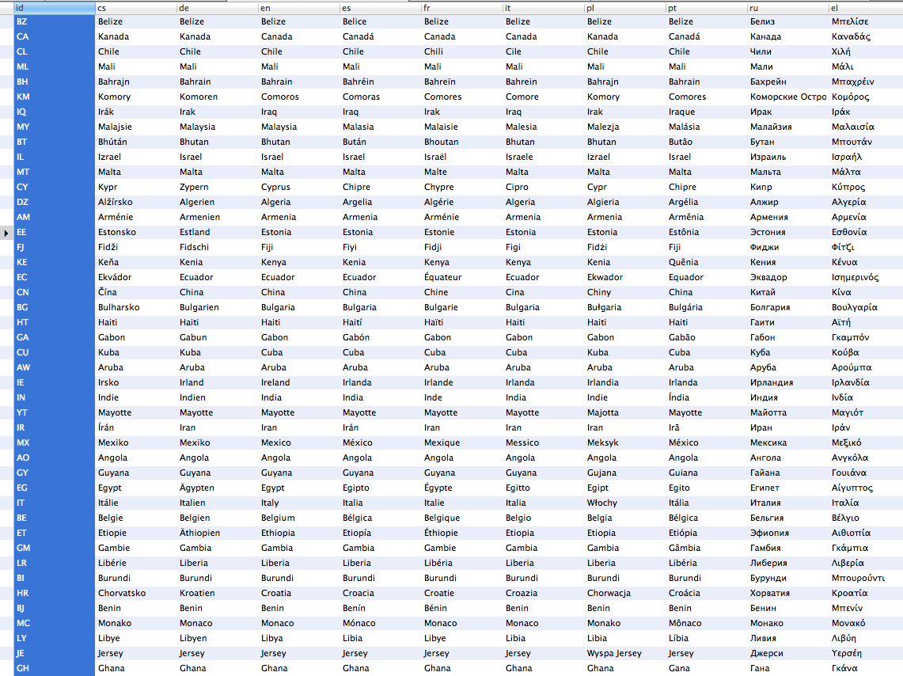

Download CSV from <https://github.com/umpirsky/country-list>
```
country/cldr/«iso code of language»/country.csv
```





Omit CSV headers

```csv
iso,name
AF,Afghánistán
AX,Alandy
AL,Albánie
```








Easy to visually check for consistency, missing values, ...



Then write script to export to JSON in format you app need, eg.:
```json
{
	"af": {
		"value": "Afghanistan",
		"translated": "Afghánistán",
		"phone": "93"
	},
	"ax": {
		"value": "Åland Islands",
		"translated": "Alandy",
		"phone": "358"
	},
	"al": {
		"value": "Albania",
		"translated": "Albánie",
		"phone": "355"
	},
```
