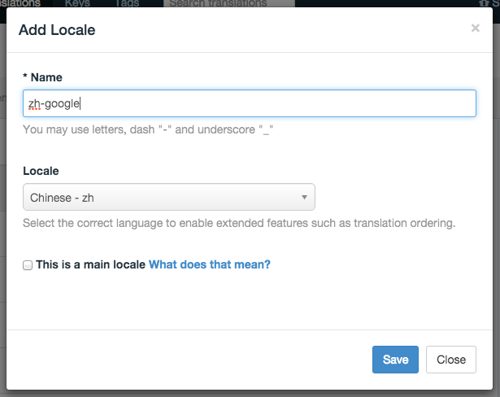
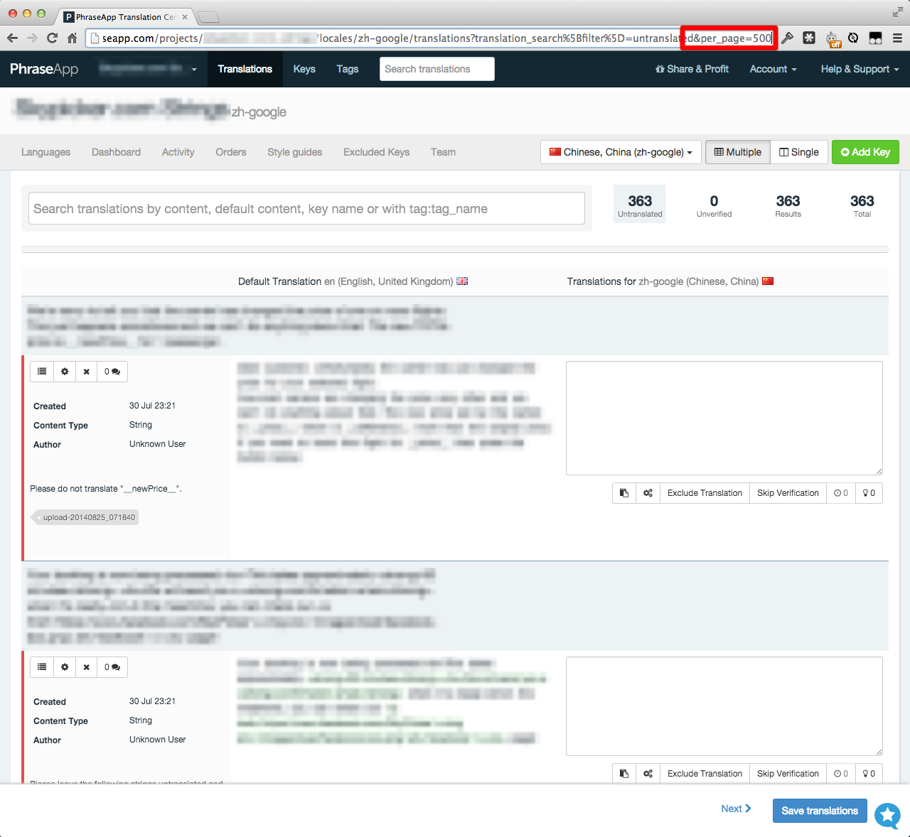
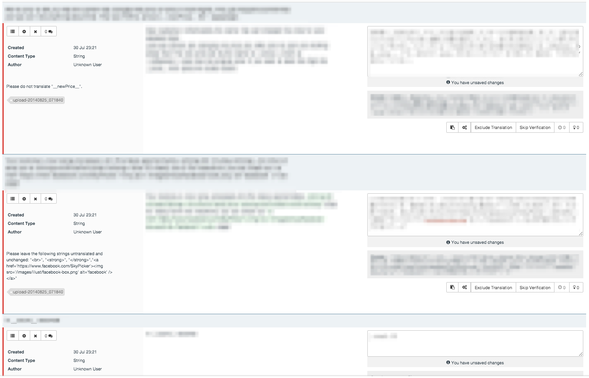

We were working on RTL version of Skypicker.com and found it hard to check if everything works without actual translated strings.
Translations take some time and we needed them now.
At the same time, we don't care about correctness just yet, we want to test if there wouldn't be any technical issues.

PhraseApp offers great Machine translation functionality powered by Google Translate. Only problem is that you one translation requires `click - wait - move mouse - click`.

And as we are developers, not monkeys, it's easier to write quick and dirty script to batch this.

#### Workflow:

* Adjust URL to show all translations on one page
* Inject our script which insert new button "Request translations from Google Translate"
* Batch request translations for all untranslated translations
* Batch use them
* Save translations

#### 1. Add locale
I added `-google` to tell that this is translated by Google, so we wouldn't actually use it in production by accident.



#### 2. Click untranslated


#### 3. Adjust URL to show all translations on one page


#### 4. Open DevTools > Console and paste the script
Then click Request translations from Google Translate at the bottom, enter how much do you wanna translate (could be slow). Wait. Hit Apply translations. Do not forget to Save translations.


No science involved. But works, so...

```js
var STRING_BATCH_SUGGEST = "Request translations from Google Translate";
var STRING_BATCH_SUGGEST_APPLY = "Apply translations";

var bar = $('#translation-options-bar');
var submitBtn = bar.find('.btn-primary').first();
var suggestBtn = $('<input type="button" class="btn" value="' + STRING_BATCH_SUGGEST + '"/>');
submitBtn.before(suggestBtn);

suggestBtn.one('click', function() {
	var limit = prompt("Enter how many translations do you wanna request from Google Translate", "50");

	var editors = $('.translation-editor');
	var emptyEditors = editors.filter(function() {
	  return $(this).find('textarea')[0].value == "";
	});
	emptyEditors = emptyEditors.slice(0, parseInt(50, 10));

	emptyEditors.each(function() {
		$(this).find('.translation-suggest').click();
	});

	suggestBtn.attr('value', STRING_BATCH_SUGGEST_APPLY);
	suggestBtn.one('click', function() {
		emptyEditors.each(function() {
			$(this).find('.suggestion-content.clickable').click();
		});
		suggestBtn.attr('value', STRING_BATCH_SUGGEST);
	});
});
```